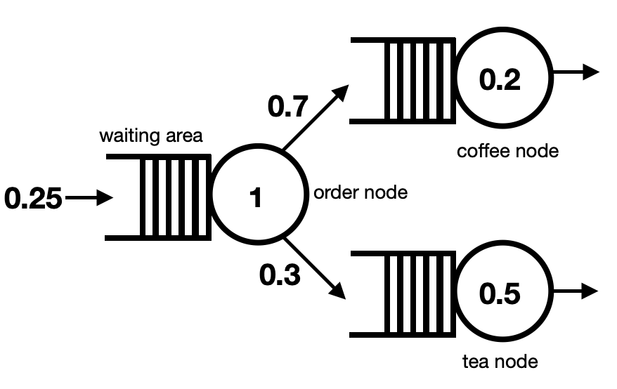

# Modelling the coffee shop I

In the example report you were given the queues are organised as is illustrated in the following diagram:

You will find the code for modelling the coffee shop with the two sequential queues that we looked at in the last exercise in the file called `main.py`.  __Your task in this exercise is to adjust this code so that the queue system that is illustrated in the above figure is modelled instead.__  To complete this task you will need to:

1. Set the `adj_list` variable correctly to setup the graph.
2. Set the `edge_list` variable correctly to ensure that the right queues are placed on the edges.
3. Define a third type of queue server object.  This will be the queue that describes how long agents have to wait to get a coffee made.

For the time being you can ignore the fact that 70% of people order a coffee and 30% of people order a tea.  When there are two possible destinations after finishing in a queue queueing tool sends 50% of agents to each of the subsequent queues by default.  We will look at how to remedy that in the next exercise.

__There is no automated feedback and checking of your answer for this assignment.  The only way to check your code is to ask me to take a look at it.  Sorry about that.__
